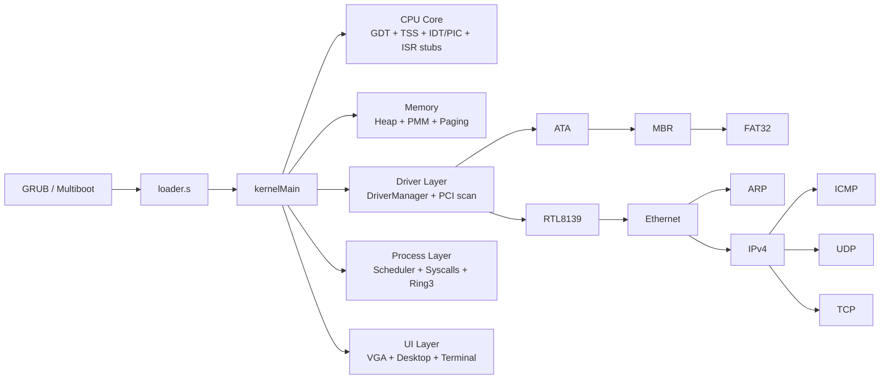
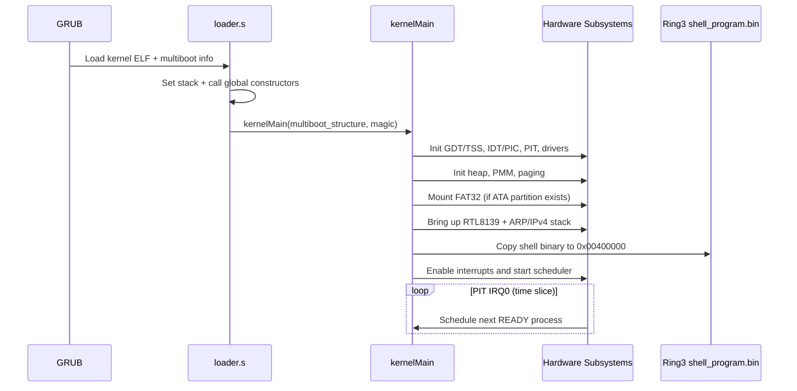

# Layla OS


Layla OS is a from-scratch 32-bit operating system kernel focused on direct hardware control and clean subsystem layering.

This repository is not a toy app wrapped in OS terms. It boots via GRUB Multiboot, owns descriptor tables and interrupt routing, drives hardware through port I/O, schedules Ring 3 processes, exposes a syscall ABI, and runs a user shell program in protected mode.

## What This Repo Contains

- A monolithic `i386` kernel in freestanding `C++` + `x86 assembly`.
- Boot path from Multiboot loader to kernel init and IRQ-driven runtime.
- Memory stack with heap allocator, physical frame manager, and paging.
- Device and bus stack: PS/2 input, PCI enumeration, ATA, RTL8139 NIC.
- Protocol stack: Ethernet, ARP, IPv4, ICMP, UDP, TCP.
- Storage stack: MBR parsing and FAT32 file reads.
- Ring 3 process model with round-robin scheduling and `int 0x80` syscalls.
- A graphics desktop surface with a terminal window and keyboard input path.

## Architecture Snapshot



## Boot and Runtime Sequence



## Subsystem Specifications

### 1) Boot, Link, and Entry

- `loader.s`: Multiboot header, stack setup, constructor dispatch, transfer to `kernelMain`.
- `linker.ld`: Links kernel at `0x00100000` with explicit `.text/.data/.bss` layout.
- `makefile`: Freestanding 32-bit build (`-m32 -nostdlib`) and ISO generation via `grub-mkrescue`.

### 2) CPU Protection and Interrupt Model

- `gdt.h/.cpp` + `gdt.s`: GDT entries for kernel/user segments and TSS; `gdt_flush` reloads segment state.
- `tss.h/.cpp`: TSS object stores Ring 0 stack pointer for privilege transitions.
- `interrupts.h/.cpp` + `interrupts.s`: IDT setup, PIC remap, IRQ dispatch, exception vectors, syscall vector `0x80`.

### 3) Memory Stack

- `memorymanagement.h/.cpp`: First-fit kernel heap allocator with chunk split/merge.
- `allocator.h/.cpp`: Global `new/delete` wired to kernel heap.
- `pmm.h/.cpp`: Physical frame bitmap allocator.
- `paging.h/.cpp`: Page directory/page table management.

Implementation details currently in code:

- Kernel selects largest usable multiboot memory region above `2 MiB`.
- Heap is capped to first `16 MiB` mapped range.
- Top `512 KiB` of that range is reserved as PMM frame pool (`128 x 4 KiB` frames).
- Kernel paging uses identity mapping for the low memory window.

### 4) Driver and Bus Layer

- `driver.h/.cpp`: Generic driver interface + `DriverManager` registry.
- `pci.h/.cpp`: PCI config space scan and BAR discovery.
- `port.h`: Raw 8/16/32-bit port I/O wrappers.

Devices currently probed and activated:

- ATA (`class 0x01, subclass 0x01`)
- RTL8139 NIC (`class 0x02, subclass 0x00`, `TypeID 0x8139`)

### 5) Storage Stack

- `ata.h/.cpp`: PIO ATA identify/read/write (`Read28/Write28`).
- `mbr.h/.cpp`: MBR signature and partition parsing.
- `fat32.h/.cpp`: FAT32 BPB parse, cluster traversal, directory/file resolution.

Current FAT32 behavior:

- Reads only; assumes `512-byte` sectors.
- Path resolution is 8.3 short-name oriented.
- Mount target is partition index `0` when present.

### 6) Networking Stack

- `net.h`: Endianness helpers + checksum utilities.
- `ethernet.h/.cpp`: Ethernet frame dispatch by ethertype.
- `arp.h/.cpp`: ARP cache + request/reply.
- `ipv4.h/.cpp`: IPv4 header handling + protocol demux.
- `icmp.h/.cpp`: Echo request/reply.
- `udp.h/.cpp`: UDP socket receive/send skeleton.
- `tcp.h/.cpp`: Minimal TCP state machine and segment handling.
- `rtl8139.h/.cpp`: NIC TX/RX ring handling and IRQ receive path.

Default runtime values in kernel init:

- Local IPv4: `10.0.2.15`
- Initial ARP probe target: `10.0.2.2`

### 7) UI, Input, and Console

- `vga.h/.cpp`: Text mode output + VGA mode 13h graphics primitives.
- `gui.h/.cpp`: Desktop/window/widget abstractions.
- `terminal.h/.cpp`: Character-grid terminal window and shell I/O bridge.
- `keyboard.h/.cpp`: PS/2 keyboard IRQ handler with scancode maps.
- `keyboard_buffer.h/.cpp`: Input ring buffer used by `sys_read`.
- `mouse.h/.cpp`: PS/2 mouse IRQ integration with desktop cursor updates.

### 8) Processes, Scheduling, and Syscalls

- `process.h/.cpp`: Process struct with kernel stack and user entry context.
- `scheduler.h/.cpp`: Round-robin scheduler on PIT IRQ0, max `16` processes.
- `syscall.h/.cpp`: `int 0x80` dispatcher.
- `shell_program.s`: Ring 3 user shell assembled to `shell_program.bin`, embedded as blob.

Implemented syscall numbers:

- `1`: `exit(status)`
- `3`: `read(fd, buf, n)`
- `4`: `write(fd, buf, n)`
- `7`: `waitpid(pid, status, options)`
- `11`: `exec(path)`
- `20`: `getpid()`

Shell commands in current Ring 3 program:

- `help`
- `clear`
- `ls`
- `meminfo`
- `exit`

### 9) Learning Notes / Design Log

- `theBooklet/`: chapter-style docs on GDT, IDT/PIC, port I/O, input devices, and PCI.

## Source Map (by Area)

| Area | Primary Files |
|---|---|
| Boot | `loader.s`, `linker.ld`, `makefile`, `kernel.cpp` |
| CPU tables | `gdt.h/.cpp/.s`, `tss.h/.cpp` |
| Interrupts | `interrupts.h/.cpp/.s`, `port.h` |
| Memory | `memorymanagement.*`, `allocator.*`, `pmm.*`, `paging.*` |
| Drivers core | `driver.*`, `pci.*` |
| Input/UI | `keyboard.*`, `keyboard_buffer.*`, `mouse.*`, `vga.*`, `gui.*`, `terminal.*` |
| Storage | `ata.*`, `mbr.*`, `fat32.*` |
| Network | `net.h`, `ethernet.*`, `arp.*`, `ipv4.*`, `icmp.*`, `udp.*`, `tcp.*`, `rtl8139.*` |
| Processes/syscalls | `process.*`, `scheduler.*`, `syscall.*`, `shell_program.s` |
| Extra sample | `userprogram.s` |

## Build and Run

### Prerequisites

- `g++` with 32-bit multilib support
- `binutils` (`as`, `ld`)
- `grub-mkrescue` or `grub2-mkrescue`
- `xorriso`
- `qemu-system-i386` (for emulation)

### Build

```bash
make mykernel.iso
```

### Run in QEMU

Basic boot:

```bash
qemu-system-i386 -cdrom mykernel.iso
```

Boot with an RTL8139 NIC attached:

```bash
qemu-system-i386 \
  -cdrom mykernel.iso \
  -device rtl8139,netdev=n0 \
  -netdev user,id=n0
```

Boot with IDE disk image (for ATA/FAT32 testing):

```bash
qemu-system-i386 \
  -cdrom mykernel.iso \
  -drive file=fat32.img,format=raw,if=ide \
  -device rtl8139,netdev=n0 \
  -netdev user,id=n0
```

## Current Scope and Limits

- Target is `x86 32-bit` protected mode.
- Single-core, no SMP.
- No userspace ELF loader yet; user code is currently injected as a flat binary blob.
- FAT32 support is intentionally narrow (short names, direct read path).
- Networking layer is functional skeleton-level for protocol bring-up and experimentation.

This scope is deliberate: the project prioritizes visibility and control of every low-level boundary over abstraction-heavy complexity.
